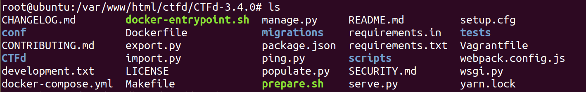

## 使用ctfd开源项目搭建自己的ctf平台

ctfd开源项目地址：https://github.com/CTFd/CTFd/releases

汉化地址：https://github.com/Gu-f/CTFd_chinese_CN/releases/tag/V1.1.1

我这里使用的是ubuntu20的虚拟机。

下载好项目之后在虚拟机里解压可得到

### 环境安装
首先进入之前解压的CTFd-3.4.0文件夹（即CTFd项目根目录）
在进行后续步骤之前，建议先使用yum安装以下几个依赖，避免pip3安装过程中出现一些问题。
执行如下个命令：

yum install -y libevent-devel

yum install -y python3-devel

yum install -y gcc

然后执行命令pip3 install -r requirements.txt

    可能出现一些安装失败的情况及注意事项：
    1、网络不通畅导致的安装失败——有一些依赖库，如果你默认使用pip3去安装的话，可能会请求一些国外的源，此时可以尝试先将pip源更换为国内的镜像源，然后再执行命令安装。
    2、缺少相关的依赖文件和程序，如常见的gcc编译失败，缺少.c或.h文件等
    3、requirements.txt涉及到的模块较多，下载会花一些时间。
    4、如果yum命令执行不成功可以尝试直接只用pip命令（我在测试时是可以直接使用的，可能需要python3，gcc等环境）

### 运行ctfd

进入ctfd目录，修改serve.py文件最后一行。

app.run(debug=True, threaded=True, host="127.0.0.1", port=args.port)

修改为app.run(debug=False, threaded=True, host="0.0.0.0", port=8080)

    对应参数解释：

    debug：是否开启debug模式

    threaded：是否开启线程模式

    host：主机地址(允许其他机器访问改成0.0.0.0)

    port：主机端口

汉化包下载完后进入自己对应的版本

将CTFd网站目录下的CTFd替换为本目录下的CTFd（这个为汉化后的版本）目录

然后进入ctfd根目录执行python3 serve.py即可运行环境。

之后访问ip+8080即可

### 安装配置

日期 & 时间、网络集成保持默认就好，然后完成。

在管理面板中就可以按照自己的想法完成自己赛事的创建了。